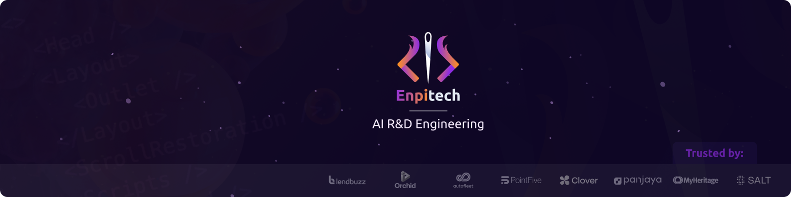

<div align="center">

<!-- Replace with your actual logo: add .github/assets/logo.png to the repo -->


<br />
<br />

# AI Tools

**A full engineering workflow distilled into structured AI skills —<br />research, plan, implement, review, and ship, with deterministic steps at every stage.**

[](LICENSE)
[](https://code.claude.com/docs/en/plugins)
[](https://github.com/enpitech/ai-tools/actions)

[Pipeline](#the-enpitech-pipeline) · [Skills by Category](#skills-by-category) · [Workflows](#example-workflows) · [Install](#installation) · [CI Setup](#ci-setup) · [Customization](#customization)

</div>

<br />

> **Built by [Enpitech](https://enpitech.dev)** — a comprehensive AI engineering toolkit for [Claude Code](https://docs.anthropic.com/en/docs/claude-code), VS Code Copilot, Cursor, and more. Five skill categories covering the full lifecycle. Works in CI and locally. Supports React, Node.js, Python, and any language.

<br />

## Quick Install

In Claude Code, run these one by one:

```
/plugin marketplace add enpitech/ai-tools
```

```
/plugin install enpitech@enpitech
```

Then `/reload-plugins` to activate. Skills become `/enpitech:<skill-name>`.

<br />

---

## The Enpitech Pipeline

Every skill belongs to one of five stages in a real engineering workflow:

```
┌────────────┐   ┌────────────┐   ┌──────────────────┐   ┌────────────┐   ┌────────────┐
│  RESEARCH  │ → │    PLAN    │ → │   IMPLEMENT      │ → │   REVIEW   │ → │    SHIP    │
│   rs-*     │   │   pl-*     │   │ figma-to-code,   │   │  cr-*,     │   │ commit,    │
│            │   │            │   │ gn-test-*        │   │  cra-*,    │   │ pr-write,  │
│            │   │            │   │                  │   │  a11y,perf │   │ changelog  │
└────────────┘   └────────────┘   └──────────────────┘   └────────────┘   └────────────┘
                                                                ↑
                                                          bug-trace, env-doctor
                                                          (debug detour any time)
```

Each stage hands off via a file (`research-brief.md` → `plan.md` → code → `cr-*-findings.md` → commit/PR). You can use any stage standalone, or chain them.

<br />

---

## Skills by Category

### 🔬 Research — `rs-*`

> Surface real-world evidence before you plan. Multi-pass searches across docs, GitHub issues, community reports, prior art, and CVEs. Mandates an adversarial creative pass.

| Skill | What it does | When to use |
|:------|:-------------|:------------|
| `rs-deep` | 8-pass deep research on any topic involving libraries, APIs, or unfamiliar stack | Before starting a non-trivial feature or investigation |
| `rs-migrate` | Research overlay for version migrations (React 18→19, Node 20→22, etc.) | Before planning any framework/runtime upgrade |
| `rs-library-pick` | Evidence-backed comparison matrix between candidate libraries | Before adding or replacing a dependency |

**Output:** `research-brief.md` with TL;DR, risks, citations, and a list of *Open questions for `pl-grill`* — the hand-off contract.

```
/enpitech:rs-deep            # General deep research
/enpitech:rs-migrate         # Migration-focused
/enpitech:rs-library-pick    # Library comparison
```

<br />

### 🧠 Plan — `pl-*`

> Grill-me-style interview that resolves every fork in the design tree before a line of code is written. Inspired by Matt Pocock's `grill-me`, retooled around the Enpitech rule files.

| Skill | What it does | When to use |
|:------|:-------------|:------------|
| `pl-grill` | 6-pass planning interview — one question at a time, each with a recommended answer | Before any non-trivial feature, bugfix, or refactor |
| `pl-architect` | Splits a large feature into a sequence of reviewable PRs, each shippable on its own | When the file map exceeds ~20 files or spans multiple layers |

**Output:** `plan.md` with Intent, Decisions, Interfaces, Risks, File map, and a numbered Step plan.

```
/enpitech:pl-grill           # Grill until the plan is unambiguous
/enpitech:pl-architect       # Multi-PR plan for large features
```

<br />

### 🛠 Implement — `figma-to-code`, `gn-test-*`

> Deterministic implementation skills. Figma → code with visual verification, and test generation that mirrors the rules used by the reviewer.

| Skill | What it does | Requirements |
|:------|:-------------|:-------------|
| `figma-to-code` | Pixel-perfect Figma → responsive production code. Auto breakpoints, DS tokens, asset export, visual verification loop | Figma MCP + Playwright MCP |
| `gn-test-react` | Generate React tests (Vitest/Jest + RTL) using accessible queries, covering loading/error/empty states and a11y | — |
| `gn-test-node` | Generate Node tests covering async paths, error handling, event-loop concerns, route-level integration | — |
| `gn-test-python` | Generate pytest tests with fixtures, async paths, and framework-level integration (Django/Flask/FastAPI) | — |

```
/enpitech:figma-to-code      # Interactive — asks for Figma URL and section details
/enpitech:gn-test-react      # Test gen for a React file/component/hook
/enpitech:gn-test-node       # Test gen for Node modules and routes
/enpitech:gn-test-python     # Test gen for Python modules and APIs
```

<br />

### 🔍 Review — `cr-*`, `cra-*`, `a11y-audit`, `perf-audit`

> Multi-pass review. Two scope prefixes plus two standalone audits. All filter to **CRITICAL** and **WARNING** at **8/10+ confidence**.

**Scope prefixes:**

| Prefix | Scope | Where | Includes deps? |
|:-------|:------|:------|:---:|
| `cr-` | PR diff + directly affected files | CI + Local | ✗ |
| `cra-` | Full codebase audit | Local only | ✓ |

**Skills:**

| Skill | Scope | What it does | CI Trigger |
|:------|:-----:|:-------------|:----------:|
| `cr-react` / `cra-react` | Diff / Full | 7-pass React/Next.js review | `/cr-react` |
| `cr-node` / `cra-node` | Diff / Full | 7-pass Node.js review (OWASP-aware) | `/cr-node` |
| `cr-python` / `cra-python` | Diff / Full | 7-pass Python review (Bandit/Ruff-aware) | `/cr-python` |
| `cr-general` / `cra-general` | Diff / Full | 5-pass language-agnostic review | `/cr-general` |
| `cr-fullstack` / `cra-fullstack` | Diff / Full | Auto-detect stack + cross-layer checks | `/cr-fullstack` |
| `cr-deps` | Deps | 6-pass dependency health audit | `/cr-deps` |
| `a11y-audit` | Diff or Full | Standalone WCAG 2.2 AA audit | (planned) |
| `perf-audit` | Diff or Full | Tier-prioritized perf audit (architecture-first) | (planned) |

```
/enpitech:cr-react           # PR diff review
/enpitech:cra-react          # Full codebase audit + system checks + dep audit
/enpitech:a11y-audit         # Standalone a11y, splits out of cr-react
/enpitech:perf-audit         # Standalone perf, Vercel-style prioritization
```

<details>
<summary><strong>📐 Detailed review passes per stack</strong></summary>

<br />

#### React/Next.js — 7 passes

| Pass | Focus | Examples |
|:-----|:------|:--------|
| 1. BUGS | Logic errors | null access, race conditions, wrong conditionals |
| 2. SECURITY | Vulnerabilities | XSS, exposed secrets, unauthenticated Server Actions |
| 3. COMPONENT ARCHITECTURE | Structure | God components, prop drilling, cross-feature imports |
| 4. HOOKS & STATE | React patterns | Derived state in useEffect, stale closures, joinable hooks |
| 5. PERFORMANCE | Speed | Sequential awaits, missing dynamic imports, barrel file imports |
| 6. CODE QUALITY | React-specific | Array mutation, missing error boundaries, duplicated logic |
| 7. INTENT CHECK | PR scope | Unrelated changes that snuck into the diff |

**Context-aware:** React Compiler, Next.js SSR/RSC, design systems (`@radix-ui`, `shadcn`).

#### Node.js — 7 passes (OWASP + eslint-plugin-security)

| Pass | Focus | Examples |
|:-----|:------|:--------|
| 1. BUGS | Logic errors | Unhandled promise rejections, race conditions, event loop blocking |
| 2. SECURITY | Vulnerabilities | `eval`/`exec` injection, prototype pollution, ReDoS, SSRF, missing helmet/CSRF |
| 3. ASYNC PATTERNS | Event loop | Blocking calls in async, missing Promise.all, stream backpressure |
| 4. ERROR HANDLING | Resilience | Bare catch, missing error events, uncaughtException without exit |
| 5. API DESIGN | Express/Fastify | Missing request size limits, rate limiting, input validation, permissive CORS |
| 6. PERFORMANCE | Runtime | Sync fs/crypto ops, missing connection pooling, N+1 queries, memory leaks |
| 7. CODE QUALITY | Node-specific | `require(variable)`, `new Buffer()`, deprecated APIs, missing graceful shutdown |

#### Python — 7 passes (Bandit + Ruff + Pylint)

| Pass | Focus | Examples |
|:-----|:------|:--------|
| 1. BUGS | Logic errors | Mutable default arguments, loop variable closures, unreachable code |
| 2. SECURITY | Vulnerabilities | `eval`/`exec`, unsafe deserialization (`pickle`), `shell=True`, SQL injection, unsafe YAML, XML attacks |
| 3. TYPE SAFETY | Type correctness | Missing annotations, inconsistent returns, overly broad `Any` |
| 4. ASYNC PATTERNS | asyncio/threading | Blocking in async, missing await, sync sleep, thread safety |
| 5. API DESIGN | Django/Flask/FastAPI | Missing auth decorators, debug mode, insecure uploads, rate limiting |
| 6. PERFORMANCE | Efficiency | Generator vs list comprehension, quadratic string concat, inefficient loops |
| 7. CODE QUALITY | Pythonic | Bare except, mutable defaults, unused imports, missing context managers |

#### General (any language) — 5 passes

Works with Vue, Angular, Svelte, Go, Rust, Ruby, PHP, Java, Kotlin, Swift, C#, and more.

| Pass | Focus | Examples |
|:-----|:------|:--------|
| 1. BUGS | Logic errors | Null access, resource leaks, concurrency issues, off-by-one |
| 2. SECURITY | Vulnerabilities | Injection, hardcoded secrets, insecure crypto, SSRF, XSS, CSRF |
| 3. ERROR HANDLING | Resilience | Silent failures, bare exception catching, missing cleanup |
| 4. PERFORMANCE | Efficiency | Blocking I/O, N+1 queries, quadratic algorithms, memory issues |
| 5. CODE QUALITY | Maintainability | Dead code, duplication, overly complex functions, deprecated APIs |

**Auto-detects** language and applies framework-specific checks (Vue `v-html`, Go unchecked errors, Rails mass assignment, Laravel raw queries, Spring injection, etc.).

#### Dependencies — 6 audit passes

| Pass | Focus | What it checks |
|:-----|:------|:---------------|
| 1. VULNERABILITIES | Security | `npm audit` / `pip-audit` — CVEs by severity |
| 2. OUTDATED | Freshness | Major version lag, security-related updates |
| 3. DEPRECATIONS | Lifecycle | Deprecated packages, suggested replacements |
| 4. LICENSE | Compliance | Copyleft in permissive projects, missing licenses |
| 5. UNUSED | Bloat | Declared but never imported dependencies |
| 6. LOCKFILE | Integrity | Missing lockfile, unpinned versions, sync issues |

Auto-detects npm, yarn, pnpm, pip, poetry, uv, pipenv. Runs standalone, or automatically as part of any `cra-*` full audit.

#### Fullstack (cross-layer auto-detect)

| Detected | Criteria applied |
|:---------|:-----------------|
| React/Next.js | `rules/react.md` |
| Express/Fastify/Koa | `rules/node.md` |
| Django/Flask/FastAPI | `rules/python.md` |
| Vue, Angular, Svelte, Go, Rust, Ruby, PHP, Java, etc. | `rules/general.md` |
| Monorepo | Reads each workspace's config to classify |

**Cross-layer checks** (always applied): API contract validation, shared type drift, env var hygiene, auth flow consistency, error contract matching, data flow security, API versioning.

</details>

<br />

### 🚀 Ship — `commit-write`, `pr-write`, `changelog`

> Workflow glue between code and remote. Reads the diff, plan, and findings — produces commit messages, PR descriptions, and release notes.

| Skill | What it does | When to use |
|:------|:-------------|:------------|
| `commit-write` | Conventional Commits from staged changes; flags breaking changes; suggests splits when stages mix concerns | Whenever you're about to commit |
| `pr-write` | PR description from branch diff + `plan.md` + any `cr-*-findings.md` | Before opening or updating a PR |
| `changelog` | User-facing release notes from git history between two refs | When cutting a release |

```
/enpitech:commit-write       # Reads staged changes, writes message
/enpitech:pr-write           # Reads branch diff + plan, writes PR body
/enpitech:changelog          # Generates CHANGELOG entry from commits
```

<br />

### 🐛 Debug — `bug-trace`, `env-doctor`

> Investigative skills. Surface root causes and local-env breakage *before* the fix is planned. Pure read-only — never edits code.

| Skill | What it does | When to use |
|:------|:-------------|:------------|
| `bug-trace` | Trace symptom → root cause via stack traces, git blame, and (optionally) web search. Outputs `bug-trace.md` for `pl-grill` to consume | When a bug is reported and the cause is non-obvious |
| `env-doctor` | Diagnose why a project won't start/build/test. Checks runtimes, deps, env vars, ports, services. Suggests one fix at a time | After fresh clone, post-pull, or "works on my machine" |

```
/enpitech:bug-trace          # Symptom → root cause, no fix written
/enpitech:env-doctor         # Diagnose local setup, read-only
```

<br />

---

## Example Workflows

How the categories chain together in real engineering scenarios.

<table>
<tr>
<td width="50%">

#### 🆕 New feature, end-to-end

```
1. /enpitech:rs-deep         # research the area
2. /enpitech:pl-grill        # plan, grilled
3. /enpitech:figma-to-code   # implement UI from Figma
4. /enpitech:gn-test-react   # generate tests
5. /enpitech:cr-react        # review the diff
6. /enpitech:a11y-audit      # standalone a11y pass
7. /enpitech:commit-write    # commit message
8. /enpitech:pr-write        # PR description
```

</td>
<td width="50%">

#### 🐛 Non-obvious bug

```
1. /enpitech:bug-trace       # symptom → root cause
2. /enpitech:pl-grill        # plan the fix (small)
3. (edit code)
4. /enpitech:cr-react        # review the fix
5. /enpitech:commit-write    # conventional commit
```

</td>
</tr>
<tr>
<td>

#### 🔁 Library upgrade / migration

```
1. /enpitech:rs-migrate      # research breaking changes
2. /enpitech:pl-architect    # split into a PR sequence
3. (per PR) /enpitech:pl-grill
4. (per PR) /enpitech:cr-*   # review each PR
5. /enpitech:changelog       # release notes
```

</td>
<td>

#### 📦 Pre-release health check

```
1. /enpitech:cra-fullstack   # full codebase audit
2. /enpitech:cr-deps         # dependency CVEs
3. /enpitech:a11y-audit --full
4. /enpitech:perf-audit --full
5. /enpitech:changelog       # release notes
```

</td>
</tr>
<tr>
<td>

#### 🤔 "Should we use X or Y?"

```
1. /enpitech:rs-library-pick # evidence-backed matrix
2. /enpitech:pl-grill        # plan the integration
3. /enpitech:cr-deps         # check the chosen dep
```

</td>
<td>

#### 💥 "Works on my machine"

```
1. /enpitech:env-doctor      # diagnose, read-only
2. (apply top suggested fix)
3. (re-run failing command)
```

</td>
</tr>
<tr>
<td>

#### 💬 PR review in CI

A developer opens a PR with React changes. A teammate comments `/cr-react`. Claude runs 7 review passes on the diff and posts threaded comments — each finding ends with "reply `/fix`", summary with "reply `/fix-all`".

</td>
<td>

#### 🎨 Figma → production code

A designer hands off a Figma section. `/enpitech:figma-to-code` pulls the design via MCP, classifies nodes as assets or UI elements, uses your design tokens, and screenshots every breakpoint until it matches.

</td>
</tr>
</table>

<br />

---

## Installation

The skills and rules are structured markdown files. They work natively as a **Claude Code plugin**, but can also be used with **any AI coding assistant** that reads instructions from your repo — including VS Code with GitHub Copilot, Cursor, Windsurf, and others.

### Option A: Claude Code Plugin (recommended)

In Claude Code, run these one by one:

```
/plugin marketplace add enpitech/ai-tools
```

```
/plugin install enpitech@enpitech
```

Then `/reload-plugins` to activate. Skills become `/enpitech:cr-react`, `/enpitech:pl-grill`, `/enpitech:rs-deep`, etc.

> **Note:** Plugins don't install workflow files. Copy the CI workflow manually:
> ```bash
> cp -r ai-tools/.github your-project/
> ```

### Option B: Copy into your project (works with any AI tool)

```bash
git clone https://github.com/enpitech/ai-tools.git

# Copy what you need
cp -r ai-tools/rules your-project/rules
cp -r ai-tools/skills your-project/skills
cp -r ai-tools/.github your-project/        # CI workflow (optional)
```

Once the files are in your repo, any AI coding assistant can use them:

| Tool | How it picks up the skills |
|:-----|:---------------------------|
| **Claude Code** | Reads `skills/` and `rules/` automatically. Invoke with `/enpitech:cr-react`, `/enpitech:pl-grill`, etc. |
| **GitHub Copilot (VS Code)** | Reference rules files as context in chat, or add to `.github/copilot-instructions.md` |
| **Cursor** | Add rules files to `.cursor/rules/` or reference them in chat context |
| **Windsurf** | Reference the criteria markdown files as project context |
| **Other AI assistants** | Point the agent to the relevant `rules/*.md` file — they're self-contained criteria |

> The `rules/*.md` files are the core value — they contain all the criteria and work with any LLM. The `skills/*/SKILL.md` files add agent-specific automation (diff collection, file scanning, output formatting, MCP orchestration).

<details>
<summary><strong>Cherry-pick what you need</strong></summary>

<br />

**Rules** (review and process criteria):

| File | Purpose |
|:-----|:--------|
| `rules/research.md` | Deep research 8-pass criteria |
| `rules/plan.md` | Grill-me planning 6-pass criteria |
| `rules/test-gen.md` | Test generation 5-pass criteria |
| `rules/react.md` | React/Next.js 7-pass review criteria |
| `rules/node.md` | Node.js 7-pass review criteria |
| `rules/python.md` | Python 7-pass review criteria |
| `rules/general.md` | Language-agnostic 5-pass review criteria |
| `rules/deps.md` | Dependency audit criteria |
| `rules/fullstack.md` | Cross-layer check criteria |
| `rules/autofix.md` | Autofix workflow (local options + CI comment format) |

**Skills** (full skill list grouped by category):

| Category | Skills |
|:---------|:-------|
| Research | `rs-deep`, `rs-migrate`, `rs-library-pick` |
| Plan | `pl-grill`, `pl-architect` |
| Implement | `figma-to-code`, `gn-test-react`, `gn-test-node`, `gn-test-python` |
| Review | `cr-react` / `cra-react`, `cr-node` / `cra-node`, `cr-python` / `cra-python`, `cr-general` / `cra-general`, `cr-fullstack` / `cra-fullstack`, `cr-deps`, `a11y-audit`, `perf-audit` |
| Ship | `commit-write`, `pr-write`, `changelog` |
| Debug | `bug-trace`, `env-doctor` |

</details>

<br />

---

## CI Setup

1. Copy `.github/workflows/claude-code-review.yml` into your repo.
2. Add `ANTHROPIC_API_KEY` to your repo secrets (Settings → Secrets → Actions).
3. Comment one of these on any PR:

### Review commands

| Trigger | Review type |
|:--------|:------------|
| `/cr-react` | React/Next.js code review |
| `/cr-node` | Node.js code review |
| `/cr-python` | Python code review |
| `/cr-general` | Language-agnostic code review |
| `/cr-deps` | Dependency health audit |
| `/cr-fullstack` | Fullstack auto-detect + cross-layer |

> `cra-*` skills (full audits) are local-only and not triggered in CI.

### Autofix commands

After a review posts findings, reply to apply fixes:

| Command | What it does | Reply to |
|:--------|:-------------|:---------|
| `/fix` | Apply the fix for a single finding | An individual finding comment |
| `/fix-all` | Apply all suggested fixes at once | The main review summary comment |

The autofix job checks out the PR branch, applies the fix(es), commits, and pushes automatically.

### How it works

- Detects the trigger keyword and selects the appropriate review criteria.
- Only runs for repo collaborators (OWNER/MEMBER/COLLABORATOR).
- Posts a summary comment with all findings, each linking to `/fix`.
- Posts individual finding replies with full details and suggested code changes.
- `/fix` and `/fix-all` replies trigger a separate job that applies fixes and pushes.

<details>
<summary><strong>Optional: Auto-trigger on PR</strong></summary>

<br />

Uncomment the `pull_request` trigger in the workflow:

```yaml
on:
  pull_request:
    types: [opened, synchronize]
  issue_comment:
    types: [created]
```

</details>

<br />

---

## Security

- Trigger restricted to repo OWNER/MEMBER/COLLABORATOR only.
- Autofix only applies changes suggested in review findings — no arbitrary modifications.
- Fix job requires explicit `/fix` or `/fix-all` reply from an authorized collaborator.
- All commits are attributed to `github-actions[bot]`.
- `env-doctor` is read-only and never prints env var values, only key presence.

<br />

## Customization

Edit the criteria files in `rules/` to add/remove passes, adjust confidence thresholds, change severity levels, or add framework-specific checks. All skills reference these files — single source of truth per concern.

| File | Controls |
|:-----|:---------|
| `rules/research.md` | Research passes, source priorities, budget caps |
| `rules/plan.md` | Planning passes, grill-me question style |
| `rules/test-gen.md` | Test generation passes, doubles policy |
| `rules/react.md` | React/Next.js review rules |
| `rules/node.md` | Node.js review rules |
| `rules/python.md` | Python review rules |
| `rules/general.md` | Language-agnostic review rules |
| `rules/deps.md` | Dependency audit rules |
| `rules/fullstack.md` | Cross-layer check rules |
| `rules/autofix.md` | Autofix workflow (local + CI) |

Implementation skills like `figma-to-code` are self-contained in their `SKILL.md` — no separate rules file needed.

<br />

---

<div align="center">

**Built with ❤️ by [Enpitech](https://enpitech.com)**

MIT License

</div>

## Contributors

<a href="https://github.com/lirankor">
  
</a>
&nbsp;&nbsp;
<a href="https://github.com/nir2002">
  
</a>

## License

MIT
